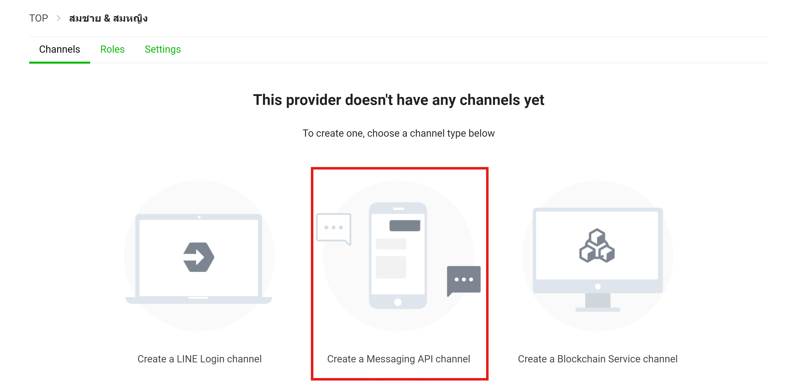
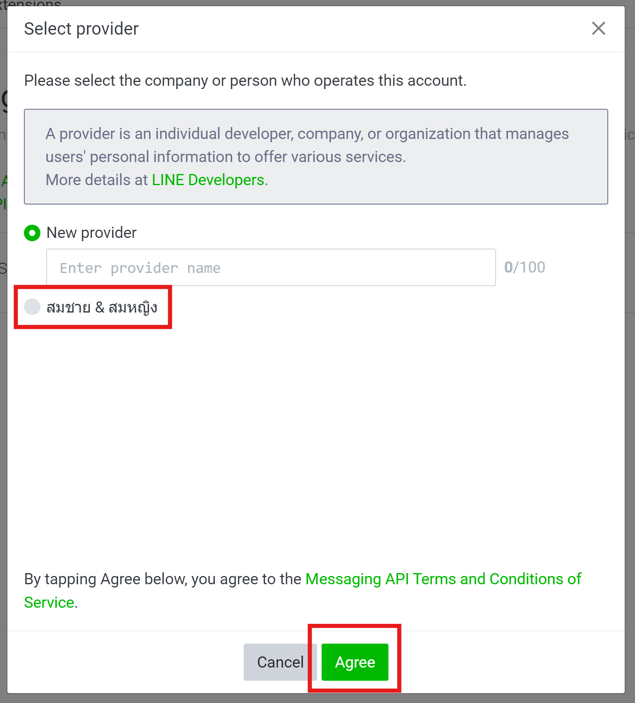

# วิธีสร้าง LINE Bot

1. ลงชื่อเข้าใช้ LINE ที่ [LINE Developers Console](https://developers.line.biz/en/)
2. คลิกที่ "Create a new provider" และกรอกข้อมูลที่จำเป็น _(ถ้าคุณมี provider อยู่แล้ว คุณสามารถข้ามขั้นตอนนี้ไปได้)_

3. คลิกที่ "Create a new channel" และเลือก "Messaging API"

4. คลิกที่ "Create a LINE Official Account"
5. กรอกข้อมูลที่จำเป็นและคลิก "Create"
)
6. เมื่อมาถึงขั้นตอนที่ 3 ของการสร้าง Channel แล้ว ให้เลื่อนลงและคลิก "Later"

7. คลิกที่ "Settings" ที่มุมขวาบน

8. คลิกที่ "Messaging API" และจากนั้นคลิก "Enable Messaging API"

9. เลือก provider ที่เราสร้างขึ้นในข้อ 1

10. ในหน้า "Privacy Policy and Terms of Use" คลิก "OK" ได้เลย

11. กลับไปที่ [LINE Developers Console](https://developers.line.biz/console)
12. เลือก Channel ที่คุณเพิ่งสร้าง

13. ใน Basic settings คลิก issue "Channel secret"
14. ใน Messaging API คลิก issue "Channel access token"

ณ ตอนนี้ คุณได้สร้าง LINE Bot แล้ว

เดี๋ยวเราจะกลับมาตั้งค่า bot ของเราเพิ่มทีหลัง
